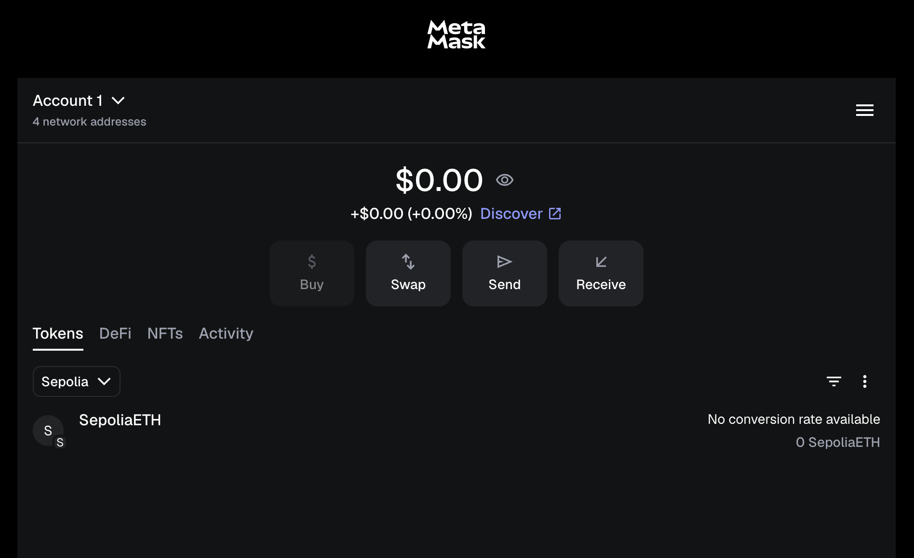

# Mini Project: First Blockchain Transaction (Using Fake Crypto)

- MetaMask is like Paytm wallet for my crypto.

- Sepolia will act as a network we can trade fake crypto on.(fake public blockchain network)

- For receiving fake crypto google cloud[https://cloud.google.com/application/web3/faucet/ethereum/sepolia].

- Sending money to my second wallet for testing and learning how it works.

- FAKE money sent and got the confirmation on my end.

- Now we can see that transaction online on the sepolia site also publicly this is the BLOCKCHAIN.

- ✅ Installed a Web3 wallet
- ✅ Switched networks
- ✅ Claimed test ETH (from a public blockchain faucet)
- ✅ Made a blockchain transaction
- ✅ Tracked it on a public explorer